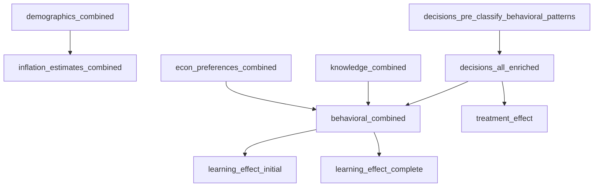

# CSV export module — agreed combined outputs

## Scope

Exports are **pandas checkpoints** from `[scripts/results.py](scripts/results.py)` (exp 1 + exp 2 merged), not raw per-experiment DuckDB dumps.

## Exact CSV exports (names match intent)

| User label                                           | Source in `results.py`                                                                                                                                                                                                                                                                                                                                                                     | Output filename                                               |
| ---------------------------------------------------- | ------------------------------------------------------------------------------------------------------------------------------------------------------------------------------------------------------------------------------------------------------------------------------------------------------------------------------------------------------------------------------------------ | ------------------------------------------------------------- |
| `demographics_combined`                              | `pd.concat` of questionnaire slices on `QUESTIONNAIRE_COLS` (~263)                                                                                                                                                                                                                                                                                                                         | `demographics_combined.csv`                                   |
| `inflation_estimates_combined`                       | `df_inflation_estimates` after harmonizing columns and `pd.concat` with `experiment` (~330)                                                                                                                                                                                                                                                                                                | `inflation_estimates_combined.csv`                            |
| `df_decisions` before “classify behavioral patterns” | `**df_decisions_all` immediately before `decision_patterns.classify_subject_decision_patterns` (first call ~764; markdown heading “Classify behavioral patterns” at ~762)                                                                                                                                                                                                                  | `decisions_pre_classify_behavioral_patterns.csv`              |
| `df_decisions_all` enriched                          | `**df_decisions_all` after** all behavioral-pattern steps used for the behavioral section: through `classify_subject_decision_patterns`, bfill group measures, `classify_perception`, qualitative + purchase-adaptation + `classify_new_decision_patterns`, and the binary recodes (`Quant Perception_consistent_12`, `purchase_adaptation_30`) (~920), **before `df_behavioral` is sliced | `decisions_all_enriched.csv`                                  |
| `knowledge_combined`                                 | `df_knowledge_all` after concat and `exp` rules (~946)                                                                                                                                                                                                                                                                                                                                     | `knowledge_combined.csv`                                      |
| `econ_preferences_combined`                          | `df_econ_preferences_all` (~948)                                                                                                                                                                                                                                                                                                                                                           | `econ_preferences_combined.csv`                               |
| `df_behavioral`                                      | `df_behavioral` after `combine_series` with knowledge + econ and column cleanup (`_x` / `_y` handling) (~963)                                                                                                                                                                                                                                                                              | `behavioral_combined.csv`                                     |
| `df_learning_effect`                                 | `intervention.create_learning_effect_table` is invoked **twice**; the second call **overwrites** the first. Export **both** (user choice): (1) first return value (~~1073), (2) “Learning effect (complete)” (~~1399)                                                                                                                                                                      | `learning_effect_initial.csv`, `learning_effect_complete.csv` |
| `df_treatment_effect`                                | `treatment_effect` from `intervention.create_diff_in_diff_table` (~~1114), after `set_index("")` (~~1130)                                                                                                                                                                                                                                                                                  | `treatment_effect.csv`                                        |

**Note:** In code, variables are named `learning_effect` and `treatment_effect` (summary tables, wide aggregates), not `df_`. Filenames above keep the user-facing names.

**Optional:** copy `[data/France HICP_20251112134158.csv](data/France HICP_20251112134158.csv)` into the export directory for notebooks that replot HICP.

## Pipeline order (dependency sketch)

`learning_effect_*` and `treatment_effect` depend on `**df_learn` / `df_treat` slices built from `df_decisions_all` (same experiment filters as in `results.py`). The exporter must build those slices after the enriched panel is ready.

## Implementation notes

1. **Refactor vs duplicate:** Prefer extracting sequential `build_` functions from `[scripts/results.py](scripts/results.py)` into a shared module (e.g. `scripts/results_pipeline.py`) so the exporter and the script do not drift; the exporter calls the same builders and then `to_csv`.
2. **First learning-effect call:** Capture the first `learning_effect` return **before** the second `create_learning_effect_table` overwrites it (or call the intervention function twice with the same inputs as each section).
3. **CSV format:** UTF-8, comma-separated, `index=False` unless a MultiIndex must be flattened for `treatment_effect` / `learning_effect` (match how `results.py` displays them after `set_index("")`).

## Out of scope

- Raw DuckDB table dumps per experiment.
- Exporting `strategies` as a standalone table unless needed for debugging.
