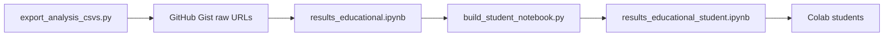

# Educational notebook from CSV exports (revised)

## Goals

- One authoring `.ipynb` plus a generated **student** variant (strip `solution`-tagged cells) for Colab.
- **Data delivery:** Students load CSVs from **GitHub Gist** raw URLs so the instructor does not distribute files manually. The notebook uses a small **URL map** (base URL or one URL per file) that you set after uploading exports to a Gist; `pd.read_csv(url)` works for public raw links.
- **Scope is intentionally slim** (see below); no DuckDB or recomputation of the full `[scripts/results.py](scripts/results.py)` pipeline.
- **Inflation sequence:** Analysis uses **only the 4×30 sequence** (`participant.inflation == 430`). Do **not** include plots, tables, or filters for the 10×12 sequence (`1012`). After loading CSVs, apply `participant.inflation == 430` (or equivalent) everywhere the decisions or behavioral data appear; drop or ignore `1012` rows. Any supplementary long-format export for inflation lines should also be **430-only** for this notebook.

## Data hosting (Gist)

- Instructor runs `[scripts/export_analysis_csvs.py](scripts/export_analysis_csvs.py)`, uploads the needed CSVs to a **public Gist** (or uses raw links from a repo), and pastes **raw** URLs into the notebook’s config cell (e.g. a `dict` mapping logical names to URLs, or a `GIST_BASE` pattern if filenames are stable).
- Document **Gist file size limits** (~100 MB per file for large gists; very large panels like `decisions_all_enriched.csv` may require splitting, sampling for teaching, or hosting the large file elsewhere—note at implementation time if needed).

## Sections to include (and explicit exclusions)

**Include**

1. **Setup** — imports, optional Colab check, **Gist URL configuration**, `pd.read_csv` for each required file.
2. **Savings game inflation rates** — line plot built from `[decisions_all_enriched.csv](data/csv_export/combined/decisions_all_enriched.csv)` (loaded from Gist). This section comes **first** among plots. **Instructor version** must document the canonical recipe (see below); the **student** version can leave plotting as an exercise with solution cells.
3. **Performance** — plot aligned with the “overall performance” / savings–stock style visualization using the decisions panel; filters include `participant.inflation == 430` only (with `Month` / `phase` as needed—same spirit as `results.py` for the 4×30 case only).
4. **Intervention summaries** — display the precomputed tables from `learning_effect_initial.csv`, `learning_effect_complete.csv`, and `treatment_effect.csv` (read with `index_col=0` where applicable).

**Exclude (do not implement in this notebook)**

- Demographics
- HICP / macro plot
- `inflation_estimates_combined` (inflation _knowledge_ questionnaire block)
- “Test difference between experiments” (e.g. Mann–Whitney blocks)
- Behavioral measure **correlation matrices** (and related Bonferroni / full correlation machinery)
- **Everything in the appendices** of `results.py` (e.g. Appendix E onward: extended performance splits, extra OLS grids, ANCOVA export path, etc.)

**Instructor plot: savings game inflation (canonical recipe, 430-only)**

- Use the **wide** panel in `decisions_all_enriched.csv` (same columns as the merged survey path in `[scripts/results.py](scripts/results.py)`): no separate long-format survey export is required for the educational notebook if the `Actual` column (and optionally `Quant Perception`, `Quant Expectation`, `Upcoming`) are present on each row.
- **Filter** to the 4×30 sequence only, then **aggregate across participants by month** to get a single path for plotting:
  - `df_430 = decisions_df[decisions_df["participant.inflation"] == 430]`
  - **Annualized / realized inflation rate for the game:** for the realized series, take the cross-participant mean of the `**Actual` column by month (this is the aggregate savings-game inflation path students see):
    - `mean_actual_430 = df_430.groupby("Month")["Actual"].mean().dropna()`
  - Plot `mean_actual_430` vs `Month` (e.g. `ax.plot(mean_actual_430.index, mean_actual_430.values, ...)`).
- Reference implementation: `[scripts/scrap.py](scripts/scrap.py)` lines 52–55 (and the surrounding plot block 57–63 for 430 only). **Do not** include the second subplot for `1012` in `[scripts/scrap.py](scripts/scrap.py)` lines 65–70 in the educational notebook; 430-only policy applies.
- **Instructor markdown** should briefly explain that `Actual` is the **realized inflation** in the savings game (aligned with the “Actual” measure in `[src/process_survey.py](src/process_survey.py)`); if the curriculum uses the phrase “annualized,” tie it to this column’s definition in-game rather than introducing a separate formula unless the course requires it.
- Optional extension: repeat the same `groupby("Month").mean()` pattern for `Quant Perception` and `Quant Expectation` on `df_430` to mirror multi-line inflation belief plots in `results.py`, still 430-only.

## Plot order (required)

1. **Savings game inflation rates** (first plot).
2. **Performance** (second plot).

## “Accordion” / hidden answers (unchanged approach)

- Solution code in cells tagged `solution`; **student** notebook = cells with that tag removed via `[scripts/build_student_notebook.py](scripts/build_student_notebook.py)`.
- Colab: students use the **student** ipynb; instructor keeps the full notebook.

## File layout

- `[notebooks/results_educational.ipynb](notebooks/results_educational.ipynb)` — authoring notebook.
- `[scripts/build_student_notebook.py](scripts/build_student_notebook.py)` — strip solution-tagged cells.
- Update `[documentation/csv_export.md](documentation/csv_export.md)` with **Gist** instructions (how to get raw URLs, which files the slim notebook needs) and student-notebook build.

## Diagram (workflow)

## Risks / notes

- **Large CSVs on Gist:** if `decisions_all_enriched.csv` exceeds practical limits, document alternatives (sampled teaching CSV, separate hosting, or course Drive link) without changing the core notebook pattern (`read_csv(url)`).
- **430-only:** Source CSVs may still contain both inflation regimes from upstream exports; the notebook must **never** branch on or visualize `1012` for this educational track.
